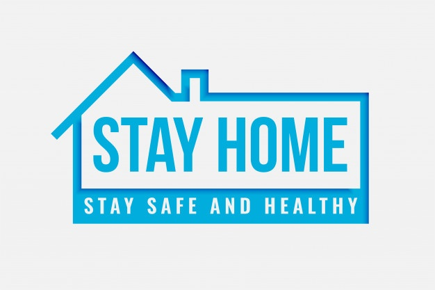
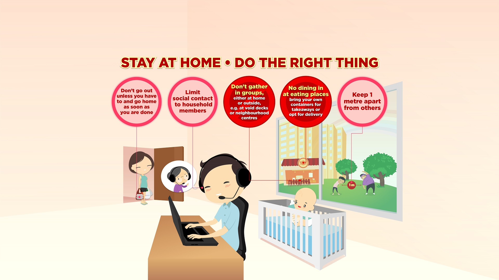

<title>MY LOCKDOWN STORY 2020</title>
<h1 style="font-size:200%;text-align:center;font-family:cooper black; MY LOCKDOWN STORY 2020</h1>

If i'm not mistaken on 17 March 2020, i went back home before MCO day (18 March 2020) start. Well we were very shocked to hear that we can't go out after 18 March then UiTM also instructed all the students to go back. We need to empty the dorm as soon as possible. I'm very lucky person because soon after the announcement make by the UiTM about not to go out of the campus on that 18 March. The sad part was when my other friends especially those who lives at Sabah and interior Sarawak can't go back due to the announcement made by the government and UiTM board regarding the students leave. Then they had to be patience that they knew they can't go back like the others. What ever it was they have to stay they all the time until Perintah Kawalan Pergerakan (PKP) end.That was very unforgetable day for me where i never expect that i won't met my friends for 2 weeks and even a month. On that day MCO was only done in 2 weeks but it actually depends on the number of Covid 19 cases. 

 Second week of MCO, never expect that MCO was extend again for 2 weeks. I get worried about my learning, studies and everything. What the most sad part was i leave my book at the dorm because i never thought that this MCO end in that 2 weeks. If i knew then i would brought all of my stuff there. Then UiTM decided to reach us by doing an online based learning which means we need to study online start from 13 April 2020. Well said that things use a lot of internet line and even money to buy the internet plans. Grateful to hear that UiTM was giving us financial assistance to those from B40 family to help them bought the internet plans as they knew that it would be a lot of financial problem faced by the students. So after giving the financial assistance then i can bought my internet plans but the other problem came. My line was not so good. I don't  have a good line coverage here. Thankful to what i have i managed to study even did it online but it was okay then as long as we did not extend our semester.

During the MCO also i baked a lot of cakes and cookies. As it was my hobbies, i did not knew what to do then i baked with my mum. The lesson that i learnt from this MCO thing was we need to appreciate our loved one especially our family. What i saw was many outsider thought that this MCO was a burden to them. It actually good, why ? because instead of just staying at home, you actually can spend you time well with your loved ones. So, Stay safe everyone and Stay at Home. Together we can do it ! Hope Covid 19 will end soon.Practice a good hygiene and protect your loved ones guys. 

By the way, i'm Fictrimeyn Vallentine from BA2402A and i'm doing my personal website for IMS456.Here i share some video on how to maintain cleanliness to avoid Covid 19 from spreading and how the covid 19 can spread to human.Click on the link below. Feel free to watch it.

<a href="https://youtu.be/rAj38E7vrS8">Stay At Home! Covid19 : Global COVID19 Prevention</a>

    
<video align="center" width="400" height="350" controls>
  <source src="Working from home during Coronavirus - 10 Tips.mp4" type="video/mp4">
  <source src="Working from home during Coronavirus - 10 Tips" type="video/mp4">
  Your browser does not support the video tag.
</video>
    

